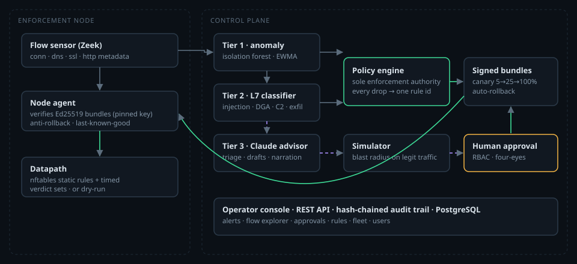

# NeuraWall

**An AI-assisted firewall that never lets a model silently drop your traffic.**

NeuraWall pairs a deterministic enforcement datapath with a three-tier inference stack.
Statistics, machine-learning detectors and Claude each *propose*. A single auditable policy
engine *decides*. A human *approves* anything that widens a block.

| | |
|---|---|
| **Tier 1 — anomaly engine** | Isolation Forest, EWMA baselines, DNS entropy and flood detection on flow metadata. Works on encrypted traffic, < 1 ms per flow. |
| **Tier 2 — L7 classifier** | SQL/command/template injection, path traversal, XSS, DGA, DNS tunnelling, C2 beaconing, exfiltration and TLS-fingerprint spoofing, with per-feature attributions. |
| **Tier 3 — Claude advisor** | Triages alerts, drafts narrowly scoped rules, narrates incidents and explains verdicts. Zero enforcement authority. Runs a deterministic offline advisor when no API key is configured. |
| **Policy engine** | The only component that can change enforcement. Every drop maps to a rule id; models alone can raise an alert, never a block. |
| **Signed bundles** | Every rule change produces an Ed25519-signed policy bundle. Nodes verify it independently of TLS, refuse older versions, and keep enforcing their last-known-good policy if the control plane is unreachable. |
| **Safe change management** | Every draft is replayed against recent traffic (blast radius over *legitimate* flows); canary rollout 5% → 25% → 100% with automatic rollback; optional four-eyes approval; tamper-evident audit chain. |



## Quick start (5 minutes, local)

```bash
docker compose -f deploy/compose/quickstart.yml up
```

Open <http://localhost:8080> and sign in as `admin@neurawall.local` / `Quickstart-Admin-1!`.
Demo mode streams synthetic enterprise traffic with occasional attacks, so the dashboards,
alerts and AI rule drafts fill in within a minute.

From source instead:

```bash
uv sync && (cd console && npm ci && npm run build)
./scripts/dev-demo.sh        # admin@neurawall.local / Demo-Admin-Pass-1!
```

## Production deployment

| Target | Guide |
|---|---|
| Single host (Docker Compose + PostgreSQL + automatic HTTPS) | [docs/deployment.md#docker-compose](docs/deployment.md#docker-compose) |
| Kubernetes (Helm; control plane + agent DaemonSet) | [docs/deployment.md#kubernetes-helm](docs/deployment.md#kubernetes-helm) |
| Bare metal / VM (systemd) | [docs/deployment.md#systemd](docs/deployment.md#systemd) |

Enforcement nodes run the agent next to a flow sensor ([Zeek](https://zeek.org) recommended)
and enforce through **nftables** on Linux, or in **dry-run** mode to evaluate without touching
the host.

To enable Claude-powered Tier 3, set `ANTHROPIC_API_KEY`. The default model is `claude-opus-5`
with adaptive thinking, structured outputs and server-side refusal fallbacks. Calls are
budgeted per hour. Flow content is passed as delimited untrusted data, and every drafted rule
is schema-validated, forced to alert-only and simulated before a human sees it.

## Documentation

- [Architecture](docs/architecture.md): how the implementation maps to the [blueprint](docs/ai-firewall-project-layout.md)
- [Deployment](docs/deployment.md) · [Configuration reference](docs/configuration.md) · [Operations runbook](docs/operations-runbook.md)
- [Security model](docs/security.md) · [API](docs/api.md) (interactive docs at `/api/docs`)
- [Architecture decision records](docs/adr/)

## Development

```bash
uv sync                          # Python 3.12+
uv run pytest                    # unit + integration tests
uv run ruff check neurawall tests && uv run mypy neurawall && uv run lint-imports
cd console && npm ci && npm run dev   # console on :5173, proxied to the API on :8080
```

The layer boundaries from the blueprint (core ← security ← modules ← services) and the rule
that the LLM advisor can never import the policy engine or datapath are enforced in CI by
`import-linter`.

## License

Proprietary. All rights reserved. See [LICENSE](LICENSE). Use, hosting or redistribution
requires written authorization from the copyright holder.
