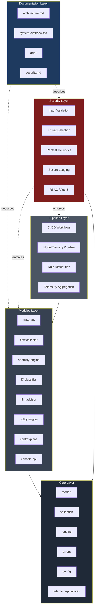
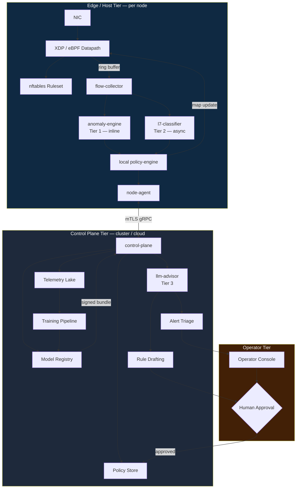
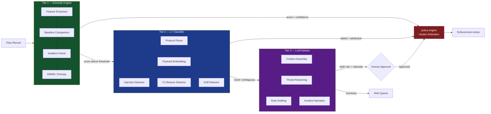
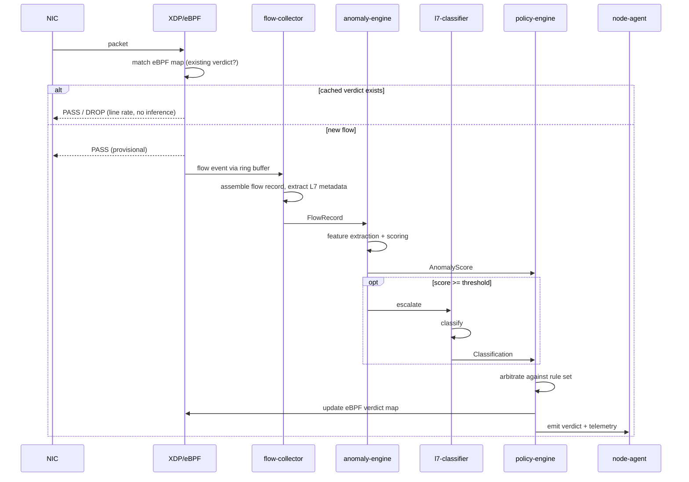
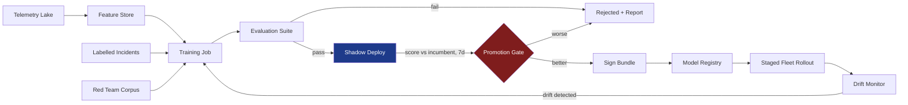
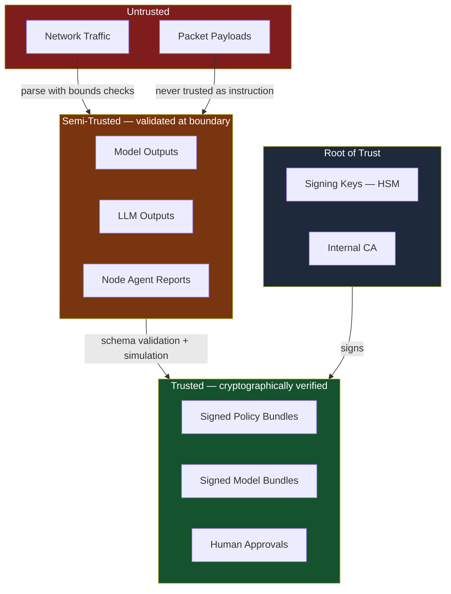

# AI-Powered Firewall — Project Layout, Architecture & Build Vision

**Codename:** `sentinel-af`
**Document type:** Architecture blueprint + implementation roadmap
**Status:** Draft for review
**Date:** 2026-09-09
**Conforms to:** `copilot-instructions.md`, `architecture.agent.md`, `pentest.agent.md`, `ADR-0001-core-architecture.md`

---

## Table of Contents

1. [Vision](#1-vision)
2. [Scope & Non-Goals](#2-scope--non-goals)
3. [Architecture Overview](#3-architecture-overview)
4. [Layer Specification](#4-layer-specification)
5. [The Three AI Tiers](#5-the-three-ai-tiers)
6. [Data Flow & Workflows](#6-data-flow--workflows)
7. [Repository Layout](#7-repository-layout)
8. [Module Contracts](#8-module-contracts)
9. [Security Model](#9-security-model)
10. [CI/CD Pipeline](#10-cicd-pipeline)
11. [Technology Decisions](#11-technology-decisions)
12. [Implementation Roadmap](#12-implementation-roadmap)
13. [Testing Strategy](#13-testing-strategy)
14. [Observability](#14-observability)
15. [Risk Register](#15-risk-register)
16. [ADR Index](#16-adr-index)
17. [Glossary](#17-glossary)

---

## 1. Vision

### 1.1. Problem Statement

Classical firewalls enforce static rules over static identifiers: addresses, ports, protocols. They cannot answer the questions that actually matter in a modern breach:

- Is this outbound TLS session beaconing to a command-and-control server on a 300-second jitter?
- Is this HTTP body a legitimate GraphQL query or an injection attempt reshaped to evade signatures?
- Is this host's traffic profile abnormal *for this host*, at this hour, on this day of the week?
- Why did rule 4471 fire, and is the rule set still coherent after six months of ad-hoc additions?

Signature engines answer none of these. They detect what has already been catalogued. `sentinel-af` is built for what has not.

### 1.2. Product Thesis

A firewall that combines a deterministic, line-rate enforcement datapath with a three-tier inference stack that scores behaviour, classifies payloads, and reasons about policy in natural language — while remaining fully auditable and never allowing a model to silently drop traffic.

### 1.3. Core Principles

| Principle | Meaning in this system |
|---|---|
| **Deterministic enforcement** | Every drop maps to an explicit rule ID. Models produce *verdicts*; rules produce *actions*. |
| **Fail-open datapath, fail-closed control** | If inference dies, traffic keeps flowing under the last-known-good rule set. If the control plane is compromised, no new rules load. |
| **Zero trust** | Every input untrusted — including model output, including internal RPC, including the rule set itself. |
| **Explainability by default** | No verdict ships without a feature attribution and a human-readable rationale. |
| **Bounded autonomy** | The LLM tier proposes; the policy engine disposes; a human approves anything that widens a block. |
| **Layered isolation** | Datapath, inference, and control plane are separate processes with separate privileges and separate failure domains. |

### 1.4. Success Criteria

| Metric | Target |
|---|---|
| Datapath added latency (p99) | < 50 µs |
| Throughput per host, single NIC | ≥ 10 Gbps line rate |
| Anomaly-tier false positive rate | < 0.1% of flows in enforce mode |
| L7 classifier inference latency (p95) | < 5 ms |
| Time from novel-threat observation to candidate rule | < 90 seconds |
| Rule-set explainability coverage | 100% of active rules carry a rationale record |
| Mean time to human triage per alert | < 2 minutes with LLM summary |

---

## 2. Scope & Non-Goals

### 2.1. In Scope

- Layer 3/4 stateful filtering on Linux hosts via eBPF/XDP and nftables.
- Layer 7 metadata inspection: HTTP, DNS, TLS handshake (SNI, JA3/JA4), QUIC.
- Kubernetes deployment: gateway mode and per-node DaemonSet mode.
- Three-tier inference stack (statistical, ML classifier, LLM reasoning).
- Centralized control plane: policy distribution, model registry, fleet management.
- Federated telemetry aggregation and central model training.
- Operator console: rule authoring, alert triage, incident timeline.

### 2.2. Out of Scope (v1)

- TLS interception / MITM decryption. Metadata only. Deliberate decision — see ADR-0004.
- Windows kernel datapath. PowerShell tooling is management-plane only.
- IPS-style active response beyond drop/rate-limit/quarantine.
- Full-packet capture retention. Sampled and flow-summary only.
- Autonomous rule deployment without human approval in enforce mode.

### 2.3. Explicit Non-Goals

- **Not** a replacement for endpoint detection and response.
- **Not** an autonomous security agent. Bounded autonomy is a design constraint, not a limitation to be removed later.
- **Not** a general-purpose SIEM. It emits to one; it is not one.

---

## 3. Architecture Overview

### 3.1. Layer Model

Per `ADR-0001-core-architecture.md`, the system uses a five-layer architecture with strict boundaries and unidirectional dependency flow.



**Dependency rule:** arrows point toward dependencies. Core depends on nothing. Modules depend only on Core. Nothing depends on Modules except Pipelines. Security is a cross-cutting enforcement layer with its own Core dependency but no Module dependency — it is called *into*, never *out of*.

### 3.2. Deployment Topology (Layered: Host + Cloud)



### 3.3. Failure Domain Isolation

| Component fails | Consequence | Recovery |
|---|---|---|
| `anomaly-engine` | Datapath continues on static rules. Tier 1 scoring stops. Alert raised. | Supervisor restart; state rebuilt from 5-min window. |
| `l7-classifier` | L7 verdicts unavailable. L3/L4 unaffected. Flows marked `unclassified`. | Restart; queue drains. |
| `llm-advisor` | No new rule drafts, no alert summaries. Enforcement unaffected. | Degraded mode banner in console. |
| `control-plane` | Nodes run last-known-good policy indefinitely. No new rules. | Nodes operate autonomously; policy TTL warning at 24h. |
| `node-agent` | Node isolated from fleet. Local enforcement intact. | Reconnect with backoff; delta sync on return. |
| **Datapath** | **Fail-open by config default.** Traffic passes unfiltered. | Highest-severity alert. Optional `fail-closed` mode for high-security zones. |

---

## 4. Layer Specification

### 4.1. Core Layer

Foundational logic with zero external module dependencies. Everything above imports from here.

| Component | Responsibility |
|---|---|
| `models` | Canonical data types: `FlowRecord`, `PacketMeta`, `Verdict`, `Rule`, `PolicyBundle`, `ThreatSignal`, `Attribution`. Immutable, versioned, serializable. |
| `validation` | Schema and constraint primitives. Every boundary crossing validates here. |
| `logging` | Structured logging with mandatory redaction hooks. No raw payloads, no credentials, no full URIs by default. |
| `errors` | Typed error hierarchy. Distinguishes `RecoverableError`, `PolicyViolation`, `IntegrityFailure`. |
| `config` | Layered configuration: defaults → file → environment → runtime override. Every value schema-checked at load. |
| `telemetry-primitives` | Counter, gauge, histogram, span abstractions. Backend-agnostic. |

**Constraint:** Core must never import from Modules, Pipelines, or Security. Enforced by an import-linter rule in CI.

### 4.2. Modules Layer

Independent functional units. Each has a defined public interface, its own tests, and its own documentation page.

| Module | Language | Role |
|---|---|---|
| `datapath` | Rust + C (eBPF) | XDP program, eBPF maps, nftables sync. Line-rate enforcement. |
| `flow-collector` | Rust | Ring-buffer consumer. Assembles packets into flow records, extracts L7 metadata. |
| `anomaly-engine` | Rust + Python | Tier 1. Statistical and unsupervised scoring on flow features. |
| `l7-classifier` | Python | Tier 2. Supervised models over HTTP/DNS/TLS metadata. |
| `llm-advisor` | Python | Tier 3. Policy drafting, alert triage, incident narration. |
| `policy-engine` | Rust | Verdict arbitration. Converts signals into rule actions. The only component permitted to change enforcement state. |
| `control-plane` | Python | Fleet management, policy distribution, model registry, telemetry ingest. |
| `console-api` | Python | Operator-facing REST/GraphQL API. Read-heavy, RBAC-gated. |
| `node-agent` | Rust | Node-side control channel. mTLS to control plane, bundle verification, local supervision. |
| `admin-tools` | PowerShell | Windows-side management: fleet queries, bundle staging, reporting. Never touches datapath. |

### 4.3. Pipeline Layer

| Pipeline | Trigger | Output |
|---|---|---|
| `ci-build` | Push, PR | Reproducible binaries, container images, signed artifacts. |
| `ci-test` | Push, PR | pytest + Pester + eBPF verifier tests + integration suite. |
| `ci-security` | Push, PR, nightly | SAST, dependency audit, pentest heuristics, container scan. |
| `model-training` | Scheduled, data-threshold | Trained model candidates + evaluation report. |
| `model-promotion` | Manual gate after training | Signed model bundle in registry. |
| `policy-distribution` | Policy commit approved | Signed policy bundle pushed to fleet with staged rollout. |
| `telemetry-aggregation` | Continuous | Normalized flow records in telemetry lake, feature store refresh. |
| `docs-sync` | Push to `main` | Rebuilt docs site, ADR index regeneration, diagram validation. |

### 4.4. Security Layer

Cross-cutting. Not a module that others call optionally — a set of enforcement points that every request traverses.

| Component | Enforcement point |
|---|---|
| `input-validation` | Every ingress: packets, API requests, model outputs, policy bundles, config files. |
| `threat-detection` | Runtime heuristics on the system's own behaviour (self-monitoring). |
| `pentest-heuristics` | Static and runtime checks derived from `pentest.agent.md` standards. |
| `secure-logging` | Redaction filters applied before any log write. Enforced at the `logging` primitive. |
| `rbac` | Role definitions and authorization checks on all control-plane and console operations. |
| `integrity` | Signature verification for policy bundles, model bundles, and binaries. |
| `audit-trail` | Append-only, tamper-evident record of every enforcement change and every human approval. |

### 4.5. Documentation Layer

Per `documentation.agent.md`, documentation is a first-class layer, not a byproduct. Every module ships with a docs page. Every architectural decision ships with an ADR. Every diagram is Mermaid, version-controlled, and validated in CI.

---

## 5. The Three AI Tiers

The defining characteristic of this system. Each tier has a different latency budget, a different failure mode, and a different level of authority.



### 5.1. Tier 1 — Statistical Anomaly Engine

**Latency budget:** < 1 ms. Runs inline, per flow.
**Authority:** Can raise a flow's suspicion score. Cannot drop on its own.

| Aspect | Detail |
|---|---|
| **Input** | Flow features: byte counts, packet sizes and inter-arrival distribution, duration, direction ratio, port entropy, TCP flag sequence, connection rate per source. |
| **Models** | Isolation Forest for multivariate outliers. EWMA baselines per `(host, service, hour-of-week)`. Shannon entropy on DNS query names and payload size distribution. Rate-of-change detectors on connection counts. |
| **Training** | Unsupervised. Continuous baseline learning with a configurable warm-up window (default 14 days). No labels needed. |
| **Output** | `AnomalyScore` in `[0.0, 1.0]` plus the top-3 contributing features. |
| **Failure mode** | Noisy on legitimate traffic-pattern shifts (deployments, business cycles). Mitigated by a change-window suppression list and per-baseline confidence intervals. |
| **Why first** | Cheap, needs no labels, works on encrypted traffic where payloads are opaque. The only tier that can run on every packet-flow at line rate. |

### 5.2. Tier 2 — L7 Metadata Classifier

**Latency budget:** < 5 ms p95. Runs asynchronously off the hot path.
**Authority:** Can produce a labelled verdict with confidence. Can trigger enforcement *if* the policy engine's confidence threshold and rule permit it.

| Aspect | Detail |
|---|---|
| **Input** | HTTP method/path/headers, DNS query names and record types, TLS ClientHello (SNI, cipher order, extensions, JA3/JA4 fingerprint), QUIC initial packet metadata, certificate chain metadata. |
| **Models** | Gradient-boosted trees on engineered features for the baseline. Small transformer encoder over tokenized request paths and DNS labels for the injection and DGA detectors. Sequence model over inter-request timing for beacon detection. |
| **Detectors** | SQL/command/template injection; DGA and DNS tunnelling; C2 beaconing (periodicity + jitter analysis); data exfiltration (volume anomaly + destination reputation + timing); TLS fingerprint mismatch (client claims browser, JA3 says otherwise). |
| **Training** | Supervised. Labelled corpus from public datasets, red-team exercises, and confirmed incidents. Retrained on schedule with drift monitoring. |
| **Output** | `Classification` with label, confidence, and SHAP-style feature attribution. |
| **Failure mode** | Distribution drift as applications change. Adversarial evasion. Mitigated by drift detection on input feature distributions and mandatory attribution review for high-impact verdicts. |
| **Constraint** | Metadata only. No TLS interception in v1 (ADR-0004). Everything must work from what is visible without decryption. |

### 5.3. Tier 3 — LLM Advisor

**Latency budget:** seconds. Fully asynchronous, human-in-the-loop.
**Authority:** **Zero direct enforcement authority.** Proposes only.

| Aspect | Detail |
|---|---|
| **Input** | Assembled context: the flow in question, Tier 1/2 outputs, related historical flows, current rule set excerpt, asset inventory entry, recent similar incidents. |
| **Functions** | (a) *Rule drafting* — propose a rule addressing a novel pattern, with rationale and blast-radius estimate. (b) *Alert triage* — cluster related alerts, rank by likely severity, write a one-paragraph summary. (c) *Incident narration* — reconstruct an attack timeline in prose from flow evidence. (d) *Rule-set hygiene* — identify shadowed, redundant, or overly-broad rules. (e) *Policy explanation* — answer "why was this blocked?" in plain language. |
| **Guardrails** | Structured output only, schema-validated. Proposed rules are simulated against a traffic replay before presentation. Blast-radius estimate mandatory. Any rule that would block more than a configured percentage of historical traffic is flagged. Prompt-injection defence: all flow content is delimited and explicitly framed as untrusted data. |
| **Output** | `RuleDraft` (never `Rule`) plus rationale, simulated impact, and confidence. Requires human approval to become a `Rule`. |
| **Failure mode** | Hallucinated rules; prompt injection via crafted payloads in the context window. Mitigated by simulation-before-presentation, structured output validation, and the absolute human-approval gate. |
| **Design stance** | The LLM makes analysts faster. It does not make enforcement decisions. This boundary is not a temporary limitation. |

### 5.4. Tier Interaction Contract

| From | To | Condition | Payload |
|---|---|---|---|
| Tier 1 | policy-engine | Always | `AnomalyScore` |
| Tier 1 | Tier 2 | `score >= t2_escalation_threshold` (default 0.6) | `FlowRecord` + score |
| Tier 2 | policy-engine | Always when invoked | `Classification` |
| Tier 2 | Tier 3 | Label is `novel`, or confidence in ambiguous band (default 0.4–0.7) | Full context bundle |
| Tier 3 | Human | Always | `RuleDraft` + rationale + simulation |
| Human | policy-engine | On approval | Signed `Rule` |

**Escalation is bounded.** Tier 2 invocation is rate-limited per node. Tier 3 invocation is rate-limited per cluster and cost-budgeted. A traffic flood cannot trigger unbounded inference spend.

---

## 6. Data Flow & Workflows

### 6.1. Packet-to-Verdict Path



**Key property:** the first packet of a flow is never blocked by inference — it passes provisionally while classification runs. Enforcement applies from the verdict update onward. This keeps the datapath at line rate and inference off the critical path. For high-security zones, a `strict` mode holds the flow in a short quarantine buffer pending Tier 1 verdict, trading a few hundred microseconds for first-packet enforcement.

### 6.2. Novel Threat to Deployed Rule

```mermaid
sequenceDiagram
    participant L as l7-classifier
    participant CP as control-plane
    participant AI as llm-advisor
    participant SIM as Rule Simulator
    participant OP as Operator
    participant F as Fleet

    L->>CP: novel pattern, low confidence
    CP->>AI: assemble context bundle
    AI->>AI: reason over evidence
    AI->>SIM: RuleDraft
    SIM->>SIM: replay 7d traffic against draft
    SIM->>AI: blast radius, FP estimate
    AI->>OP: draft + rationale + impact
    OP->>OP: review
    alt approved
        OP->>CP: sign and commit rule
        CP->>F: staged rollout (canary 5% → 25% → 100%)
        F->>CP: telemetry per stage
        CP->>CP: auto-rollback if FP rate breach
    else rejected
        OP->>CP: reject + reason
        CP->>AI: negative feedback to training set
    end
```



### 6.3. Model Lifecycle



**Shadow deploy is mandatory.** A new model runs alongside the incumbent, producing verdicts that are logged but not enforced, for a minimum of seven days. Promotion requires measurably better performance on the evaluation suite *and* no regression in production shadow scoring.

---

## 7. Repository Layout

Naming follows `copilot-instructions.md` §3.2: folders and files `kebab-case`, Python `snake_case`, PowerShell `Verb-Noun`, classes `PascalCase`.

```
sentinel-af/
├─ .github/
│  ├─ copilot-instructions.md
│  ├─ agents/
│  │  ├─ architecture.agent.md
│  │  ├─ documentation.agent.md
│  │  └─ pentest.agent.md
│  └─ workflows/
│     ├─ ci-build.yml
│     ├─ ci-test.yml
│     ├─ ci-security.yml
│     ├─ model-training.yml
│     ├─ policy-distribution.yml
│     └─ docs-sync.yml
│
├─ .copilot/
│  └─ prompts/
│     ├─ architecture.prompt.md
│     ├─ documentation.prompt.md
│     ├─ refactor.prompt.md
│     ├─ threat-model.prompt.md
│     └─ rule-review.prompt.md
│
├─ core/
│  ├─ models/                    # FlowRecord, Verdict, Rule, PolicyBundle, ThreatSignal
│  ├─ validation/                # schema primitives, constraint checks
│  ├─ logging/                   # structured logging + redaction hooks
│  ├─ errors/                    # typed error hierarchy
│  ├─ config/                    # layered config loader
│  └─ telemetry-primitives/      # counters, gauges, histograms, spans
│
├─ modules/
│  ├─ datapath/
│  │  ├─ ebpf/                   # XDP programs, map definitions
│  │  ├─ loader/                 # program load, verifier interaction, map lifecycle
│  │  ├─ nftables-sync/          # slow-path rule materialization
│  │  └─ docs/
│  ├─ flow-collector/
│  │  ├─ ring-consumer/
│  │  ├─ flow-assembly/
│  │  ├─ l7-extract/             # HTTP, DNS, TLS, QUIC metadata parsers
│  │  └─ docs/
│  ├─ anomaly-engine/
│  │  ├─ features/               # feature extraction
│  │  ├─ baselines/              # EWMA, per-entity profiles
│  │  ├─ detectors/              # isolation forest, entropy, rate-of-change
│  │  ├─ scoring/
│  │  └─ docs/
│  ├─ l7-classifier/
│  │  ├─ preprocessing/
│  │  ├─ detectors/
│  │  │  ├─ injection/
│  │  │  ├─ dga-tunnel/
│  │  │  ├─ beacon/
│  │  │  ├─ exfiltration/
│  │  │  └─ tls-fingerprint/
│  │  ├─ inference-server/
│  │  ├─ attribution/            # feature attribution for explainability
│  │  └─ docs/
│  ├─ llm-advisor/
│  │  ├─ context-assembly/
│  │  ├─ rule-drafting/
│  │  ├─ alert-triage/
│  │  ├─ incident-narration/
│  │  ├─ ruleset-hygiene/
│  │  ├─ guardrails/             # output schema validation, injection defence
│  │  └─ docs/
│  ├─ policy-engine/
│  │  ├─ arbitration/            # signal → verdict resolution
│  │  ├─ ruleset/                # rule representation, compilation, conflict detection
│  │  ├─ simulator/              # traffic replay against candidate rules
│  │  ├─ rollout/                # staged deployment, auto-rollback
│  │  └─ docs/
│  ├─ control-plane/
│  │  ├─ fleet/                  # node registry, health, enrollment
│  │  ├─ policy-store/
│  │  ├─ model-registry/
│  │  ├─ telemetry-ingest/
│  │  ├─ api/                    # gRPC service for node-agent
│  │  └─ docs/
│  ├─ node-agent/
│  │  ├─ transport/              # mTLS gRPC client
│  │  ├─ bundle-verify/          # signature verification
│  │  ├─ supervisor/             # local process supervision
│  │  └─ docs/
│  ├─ console-api/
│  │  ├─ rules/
│  │  ├─ alerts/
│  │  ├─ incidents/
│  │  ├─ fleet/
│  │  ├─ auth/
│  │  └─ docs/
│  └─ admin-tools/               # PowerShell, Verb-Noun
│     ├─ Get-FleetStatus/
│     ├─ Export-IncidentReport/
│     ├─ Test-PolicyBundle/
│     └─ docs/
│
├─ pipelines/
│  ├─ model-training/
│  │  ├─ feature-store/
│  │  ├─ training-jobs/
│  │  ├─ evaluation/
│  │  └─ promotion/
│  ├─ policy-distribution/
│  ├─ telemetry-aggregation/
│  └─ deployment/
│     ├─ helm/                   # Kubernetes chart
│     ├─ daemonset/              # per-node deployment
│     ├─ gateway/                # gateway-mode deployment
│     └─ systemd/                # bare-metal host deployment
│
├─ security/
│  ├─ input-validation/
│  ├─ threat-detection/          # self-monitoring heuristics
│  ├─ pentest-heuristics/
│  ├─ secure-logging/            # redaction filters
│  ├─ rbac/
│  ├─ integrity/                 # bundle and binary signature verification
│  ├─ audit-trail/
│  └─ threat-models/
│     ├─ datapath.md
│     ├─ inference-stack.md
│     ├─ control-plane.md
│     └─ llm-advisor.md
│
├─ tests/
│  ├─ unit/
│  ├─ integration/
│  ├─ ebpf-verifier/
│  ├─ traffic-replay/            # pcap corpus, golden verdicts
│  ├─ adversarial/               # evasion and injection test suite
│  ├─ performance/               # latency and throughput benchmarks
│  └─ pester/                    # PowerShell tests
│
├─ docs/
│  ├─ architecture.md
│  ├─ system-overview.md
│  ├─ security.md
│  ├─ ai-tiers.md
│  ├─ deployment.md
│  ├─ operations-runbook.md
│  ├─ api-reference.md
│  ├─ diagrams/
│  └─ adr/
│     ├─ ADR-0001-core-architecture.md
│     ├─ ADR-0002-ebpf-datapath.md
│     ├─ ADR-0003-three-tier-inference.md
│     ├─ ADR-0004-no-tls-interception.md
│     ├─ ADR-0005-human-in-the-loop-enforcement.md
│     ├─ ADR-0006-fail-open-datapath.md
│     └─ ADR-0007-model-promotion-gates.md
│
├─ LICENSE
└─ README.md
```

---

## 8. Module Contracts

Each module exposes a narrow, versioned interface. Contracts are described here in prose and formalized as schemas in `core/models`.

| Module | Consumes | Produces | Must never |
|---|---|---|---|
| `datapath` | eBPF verdict maps, nftables rules | Packet events on ring buffer, per-flow counters | Call any inference component; allocate on the packet path |
| `flow-collector` | Ring buffer events | `FlowRecord` with L7 metadata | Retain full payloads; block on downstream backpressure |
| `anomaly-engine` | `FlowRecord` | `AnomalyScore` + top features | Emit an enforcement action; exceed its latency budget |
| `l7-classifier` | `FlowRecord` (escalated) | `Classification` + attribution | Run on the packet hot path; be invoked without rate limiting |
| `llm-advisor` | Context bundle | `RuleDraft`, `AlertSummary`, `IncidentNarrative` | Produce a `Rule`; write to the policy store directly |
| `policy-engine` | Signals from all tiers, rule set | `Verdict`, eBPF map updates | Accept an unsigned rule; apply a rule that failed simulation |
| `control-plane` | Node telemetry, policy commits | Signed bundles, fleet state | Push an unsigned bundle; accept an unauthenticated node |
| `node-agent` | Signed bundles | Local supervision, telemetry upload | Apply a bundle with an invalid signature |
| `console-api` | Control-plane state | REST/GraphQL responses | Expose raw payloads; bypass RBAC |

**The critical invariant:** `policy-engine` is the sole component permitted to mutate enforcement state. Every other module produces signals. This single choke point is what makes the system auditable — every drop traces to one rule, applied by one component, recorded in one audit trail.

---

## 9. Security Model

Zero trust per `copilot-instructions.md` §4 and `pentest.agent.md`.

### 9.1. Trust Boundaries



### 9.2. Threat Model Summary

| Threat | Vector | Mitigation |
|---|---|---|
| **Model evasion** | Crafted traffic shaped to score below threshold | Ensemble across tiers; adversarial training corpus; anomaly tier catches what classifier misses |
| **Model poisoning** | Injecting benign-labelled malicious traffic into the training set | Labelled data requires provenance; training set changes are reviewed; shadow deployment catches degradation |
| **Prompt injection into Tier 3** | Payload text crafted to manipulate the LLM's reasoning | All flow content delimited and framed as untrusted data; structured output schema; simulation before presentation; human approval gate |
| **Rule-set corruption** | Unauthorized policy modification | Signed bundles; append-only audit trail; node-side signature verification |
| **Control-plane compromise** | Attacker gains control-plane access | Nodes verify signatures independently; signing keys in HSM, separate from control plane; rule changes require human approval with separate credentials |
| **Datapath DoS** | Traffic flood to exhaust inference capacity | Datapath fails open under load; inference is rate-limited and queue-bounded; enforcement continues on cached verdicts |
| **Telemetry leakage** | Sensitive data in logs or telemetry | Redaction enforced at the logging primitive, not at call sites; no full URIs, no payloads, no credentials; PII scrubbing before telemetry upload |
| **Insider rule abuse** | Operator adds a rule to permit malicious traffic | All rule changes audited with identity; blast-radius simulation recorded; periodic hygiene review by Tier 3 flags overly-permissive rules |
| **Supply chain** | Compromised dependency | Pinned dependencies with hash verification; SBOM per build; reproducible builds; dependency audit in CI |

### 9.3. Zero-Trust Enforcement Points

Every one of these is a mandatory validation gate, not an optional check:

1. **Packet parse** — bounds-checked, length-validated, malformed packets counted and dropped, never parsed further.
2. **Flow record construction** — schema-validated before leaving `flow-collector`.
3. **Model output** — range-checked, schema-validated. A model returning an out-of-range score is a fault, not a verdict.
4. **LLM output** — strict schema, no free-form field reaches the policy store.
5. **Policy bundle** — signature verified on the node, independently of transport security.
6. **Model bundle** — signature verified before load; hash matched against registry.
7. **Console API request** — authenticated, authorized, input-validated, rate-limited.
8. **Inter-service RPC** — mTLS with per-service identity; no implicit trust from network position.
9. **Configuration load** — schema-validated; unknown keys rejected, not ignored.

### 9.4. Secure Logging Rules

Enforced at `core/logging`, not left to callers:

- No packet payloads. Ever.
- No full URIs. Path prefix only, query strings stripped.
- No credentials, tokens, cookies, or authorization headers.
- IP addresses hashed with a rotating salt in exported telemetry; plaintext only in local audit logs with restricted access.
- DNS query names truncated to registrable domain in telemetry; full name only in local investigation buffers with TTL.
- Every log line carries a trace ID for correlation without content exposure.

---

## 10. CI/CD Pipeline

```mermaid
graph LR
    PR[Pull Request] --> LINT[Lint + Format]
    LINT --> IMP[Import Boundary Check]
    IMP --> UT[Unit Tests<br/>pytest + Pester]
    UT --> EBPF[eBPF Verifier Tests]
    EBPF --> INT[Integration Tests]
    INT --> REP[Traffic Replay<br/>Golden Verdicts]
    REP --> ADV[Adversarial Suite]
    ADV --> SEC[SAST + Dependency Audit]
    SEC --> PERF[Performance Benchmarks]
    PERF --> DOC[Docs + Diagram Validation]
    DOC --> BUILD[Reproducible Build]
    BUILD --> SIGN[Sign Artifacts + SBOM]
    SIGN --> STAGE[Staging Deploy]
    STAGE --> SOAK[24h Soak Test]
    SOAK --> GATE{Release Gate}
    GATE -->|manual approval| PROD[Production Rollout]

    style GATE fill:#7f1d1d,color:#fff
    style ADV fill:#78350f,color:#fff
```



### 10.1. Gate Definitions

| Gate | Blocks merge on |
|---|---|
| Import boundary check | Any violation of the layer dependency rule (Core importing Modules, etc.) |
| Unit tests | Coverage below threshold; any failure |
| eBPF verifier | Any program the kernel verifier rejects |
| Traffic replay | Any change in verdict for the golden pcap corpus without an explicit approved diff |
| Adversarial suite | Detection rate regression on the evasion corpus |
| SAST + audit | Any high or critical finding; any dependency with a known CVE above threshold |
| Performance | p99 datapath latency regression > 10%; throughput regression > 5% |
| Docs validation | Broken Mermaid; missing module docs page; ADR referenced but absent |

### 10.2. Determinism Requirements

Per `copilot-instructions.md` §5.2 — pipelines must be deterministic:

- Pinned toolchain versions, pinned base images by digest.
- Pinned dependencies with hash verification.
- Fixed random seeds in model evaluation.
- Reproducible builds verified by rebuilding and comparing hashes in a separate job.
- No network access during build steps beyond a pinned artifact mirror.

---

## 11. Technology Decisions

| Concern | Choice | Rationale | Rejected alternative |
|---|---|---|---|
| Datapath | eBPF/XDP + nftables | Kernel-speed filtering without a custom kernel module; verifier gives safety guarantees; nftables for stateful slow path | DPDK — higher throughput ceiling but dedicates NICs and cores, poor fit for general host deployment |
| Datapath language | Rust (userspace) + C (eBPF) | Memory safety in the loader and collector; C is the practical eBPF target | Go — GC pauses unacceptable on the collector path |
| Tier 1 runtime | Rust with embedded scoring | Latency budget under 1 ms rules out an IPC hop to Python | Pure Python — 10× the latency budget |
| Tier 2 runtime | Python inference server | Ecosystem for model tooling; async path tolerates the latency | Rust inference — faster but multiplies model-deployment friction |
| Tier 3 | External LLM API with local fallback | Reasoning quality; cost-bounded and rate-limited; no enforcement authority so latency and availability are non-critical | Self-hosted only — meaningfully weaker reasoning at this scale |
| Control-plane transport | gRPC over mTLS | Streaming telemetry, bidirectional, strong typing, per-service identity | REST polling — worse for fleet-scale telemetry |
| Policy storage | Git-backed store + signed bundles | Rule changes get review, history, and blame for free; signing decouples integrity from transport | Database-only — loses review workflow and history |
| Telemetry store | Columnar lake + time-series for metrics | Flow records are analytical workloads; metrics are operational | Single store — one of the two workloads always suffers |
| K8s deployment | DaemonSet (node) + optional gateway | Node mode sees all pod traffic; gateway mode for north-south | Sidecar-only — per-pod overhead, misses node-level traffic |
| Signing | HSM-backed keys, separate from control plane | Control-plane compromise must not yield rule-signing capability | Software keys on the control plane — single point of total compromise |

---

## 12. Implementation Roadmap

Sequenced so each phase produces something demonstrable and testable.

### Phase 0 — Foundation (Weeks 1–3)

Build the Core layer and the scaffolding everything else depends on.

- `core/models`, `core/validation`, `core/logging`, `core/errors`, `core/config`.
- Repository structure, CI skeleton, import-boundary linter.
- ADR-0001 through ADR-0003 written and accepted.
- `docs/architecture.md` and `docs/system-overview.md` initial versions.

**Exit criteria:** CI green on an empty-module repo; layer boundaries enforced by tooling; core types stable and documented.

### Phase 1 — Deterministic Datapath (Weeks 4–9)

A working classical firewall with no AI. Prove the enforcement path before adding intelligence.

- `datapath`: XDP program, verdict maps, nftables sync.
- `flow-collector`: ring-buffer consumer, flow assembly.
- `policy-engine`: rule representation, static rule arbitration, map updates.
- `tests/traffic-replay`: golden pcap corpus with expected verdicts.
- `tests/performance`: latency and throughput benchmarks in CI.

**Exit criteria:** 10 Gbps line rate on reference hardware; p99 added latency under 50 µs; golden corpus passes; fail-open verified under process kill.

### Phase 2 — Tier 1 Anomaly Engine (Weeks 10–15)

- `anomaly-engine`: feature extraction, EWMA baselines, isolation forest, entropy detectors.
- Baseline warm-up and per-entity profile storage.
- `policy-engine`: score-aware arbitration, thresholds, alert-only mode.
- Attribution output — top contributing features per score.

**Exit criteria:** running in alert-only mode on real traffic for 14 days; false-positive rate characterized; scoring adds under 1 ms.

### Phase 3 — Control Plane & Fleet (Weeks 16–22)

- `control-plane`: node registry, policy store, telemetry ingest.
- `node-agent`: mTLS transport, bundle verification, supervision.
- `security/integrity`: signing infrastructure, HSM integration.
- `pipelines/policy-distribution`: staged rollout with auto-rollback.
- `console-api` and operator console v1: rule view, alert list, fleet health.

**Exit criteria:** multi-node fleet under central policy; signed bundle rollout with canary staging; verified node-side rejection of unsigned bundles.

### Phase 4 — Tier 2 L7 Classifier (Weeks 23–32)

- `flow-collector/l7-extract`: HTTP, DNS, TLS, QUIC metadata parsers.
- `l7-classifier`: injection, DGA/tunnelling, beacon, exfiltration, TLS-fingerprint detectors.
- `pipelines/model-training`: feature store, training jobs, evaluation suite.
- Model registry, shadow deployment, drift monitoring.
- `tests/adversarial`: evasion corpus.

**Exit criteria:** each detector passing evaluation thresholds; 7-day shadow deployment showing no regression; p95 inference under 5 ms; adversarial suite baseline established.

### Phase 5 — Tier 3 LLM Advisor (Weeks 33–40)

- `llm-advisor`: context assembly, rule drafting, alert triage, incident narration, hygiene analysis.
- `llm-advisor/guardrails`: output schema validation, prompt-injection defence.
- `policy-engine/simulator`: traffic replay against candidate rules, blast-radius estimation.
- Approval workflow in the console.

**Exit criteria:** drafted rules simulated before presentation in 100% of cases; injection-defence test suite passing; analyst triage time measurably reduced in a controlled trial.

### Phase 6 — Hardening & Operations (Weeks 41–48)

- Full threat model review per `pentest.agent.md`; external penetration test.
- `docs/operations-runbook.md`, incident response procedures.
- `admin-tools` PowerShell suite.
- Performance tuning, chaos testing of failure domains.
- Documentation completeness audit; ADR backfill.

**Exit criteria:** external pentest findings resolved; every failure domain in §3.3 verified by chaos test; documentation audit passing.

### 12.1. Team Shape

| Role | Count | Phases |
|---|---|---|
| Systems engineer (Rust/eBPF) | 2 | 1–6 |
| ML engineer | 2 | 2, 4, 5 |
| Backend engineer (control plane) | 2 | 3–6 |
| Security engineer | 1 | 0–6, lead on 6 |
| Frontend engineer (console) | 1 | 3–5 |
| Technical writer / doc owner | 0.5 | 0–6 |

A smaller team can build this by extending phase durations — the sequencing matters more than the parallelism. Phases 1 and 2 are the critical path; Phase 5 can slip without blocking a shippable product.

---

## 13. Testing Strategy

| Suite | Scope | Tooling | Gate |
|---|---|---|---|
| Unit | Every module, isolated | pytest, cargo test, Pester | Merge |
| Integration | Cross-module contracts | pytest + containerized fixtures | Merge |
| eBPF verifier | Every eBPF program loads cleanly | Kernel verifier in CI | Merge |
| Traffic replay | Golden pcap corpus → expected verdicts | Custom harness | Merge |
| Adversarial | Evasion, injection, poisoning attempts | Custom corpus + red-team contributions | Merge |
| Model evaluation | Precision, recall, FP rate per detector | Evaluation pipeline | Model promotion |
| Shadow production | New model vs incumbent on live traffic | Shadow deploy | Model promotion |
| Performance | Latency, throughput, memory | Benchmark harness | Merge |
| Chaos | Each failure domain in §3.3 | Fault injection | Release |
| Soak | 24h under production-like load | Staging environment | Release |

**Golden-corpus discipline:** the traffic-replay suite is the regression net for the entire enforcement path. Any change in verdict on a known pcap must be explicitly approved and the corpus updated with a documented reason. This is what prevents silent behavioural drift as models are retrained.

---

## 14. Observability

| Signal | Content | Retention |
|---|---|---|
| Metrics | Throughput, drop rate, latency histograms, inference queue depth, model score distributions, escalation rates per tier | 13 months |
| Flow telemetry | Flow summaries with hashed identifiers, verdicts, scores, attributions | 90 days |
| Audit trail | Every rule change, approval, model promotion, config change — with identity and rationale | 7 years, append-only |
| Traces | Request path through the inference stack, sampled | 14 days |
| Model observability | Input feature distributions, drift metrics, per-detector confusion matrices over time | 13 months |

**Model observability is non-optional.** A firewall whose models have silently drifted is worse than one with no models — it produces confident wrong answers. Feature distribution monitoring is the early warning.

---

## 15. Risk Register

| Risk | Likelihood | Impact | Mitigation |
|---|---|---|---|
| False positives erode operator trust | High | High | Alert-only mode by default for new detectors; per-detector enable; blast-radius simulation; easy rollback |
| Inference cost exceeds budget | Medium | Medium | Hard rate limits per tier; cost budget with circuit breaker; Tier 3 invocation is bounded per cluster |
| eBPF portability across kernel versions | Medium | High | CO-RE (compile once, run everywhere); minimum kernel version documented; verifier tests across a kernel matrix in CI |
| Model drift undetected | Medium | High | Feature distribution monitoring; scheduled retraining; shadow deployment before every promotion |
| Prompt injection succeeds against Tier 3 | Medium | Medium | Human approval gate makes this a nuisance rather than a compromise; structured output; adversarial test suite |
| Encrypted traffic limits Tier 2 | High | Medium | Accepted constraint — metadata-only detection is the design (ADR-0004). Tier 1 works regardless of encryption |
| Scope creep into IPS/EDR territory | High | Medium | Non-goals in §2.3 are enforced at design review; new capability requires an ADR |
| Layer boundary erosion under delivery pressure | Medium | High | Import-boundary linter is a merge gate, not a convention |

---

## 16. ADR Index

| ADR | Title | Status | Decides |
|---|---|---|---|
| 0001 | Core Architecture Model | Accepted | Five-layer architecture, module boundaries, dependency direction |
| 0002 | eBPF/XDP Datapath | Proposed | Kernel datapath technology, fail-open default, nftables slow path |
| 0003 | Three-Tier Inference Stack | Proposed | Tier responsibilities, escalation thresholds, authority boundaries |
| 0004 | No TLS Interception in v1 | Proposed | Metadata-only L7 inspection; consequences for detection coverage |
| 0005 | Human-in-the-Loop Enforcement | Proposed | LLM proposes, human approves, policy-engine enforces |
| 0006 | Fail-Open Datapath Default | Proposed | Availability over enforcement by default; opt-in fail-closed zones |
| 0007 | Model Promotion Gates | Proposed | Shadow deployment requirement, evaluation thresholds, rollback triggers |

Each ADR follows the format established in `ADR-0001-core-architecture.md`: Status, Date, Context, Decision, Rationale, Consequences (positive and negative), Alternatives Considered, Final Notes.

---

## 17. Glossary

| Term | Definition |
|---|---|
| **XDP** | eXpress Data Path — eBPF hook at the earliest point in the Linux network stack, before socket buffer allocation |
| **CO-RE** | Compile Once, Run Everywhere — eBPF portability mechanism across kernel versions |
| **JA3 / JA4** | TLS client fingerprints derived from ClientHello field ordering and content |
| **DGA** | Domain Generation Algorithm — malware technique producing many candidate C2 domains |
| **Beaconing** | Periodic outbound connections from a compromised host to a C2 server |
| **EWMA** | Exponentially Weighted Moving Average — baseline technique weighting recent observations more heavily |
| **Blast radius** | The volume of legitimate traffic a candidate rule would affect, measured by simulation |
| **Shadow deployment** | Running a model in production producing logged-but-unenforced verdicts, for comparison against the incumbent |
| **Golden corpus** | A fixed set of pcaps with known-correct verdicts, used as an enforcement regression net |
| **Fail-open** | On component failure, traffic passes rather than being blocked |
| **Bounded autonomy** | Design constraint where AI components propose actions but cannot execute them without human approval |

---

## Final Notes

Three design commitments define this system and should not be traded away under delivery pressure:

1. **The policy engine is the only component that changes enforcement state.** Every signal converges there. This is what makes the system auditable.
2. **The LLM has no enforcement authority.** Not "not yet" — by design. It makes analysts faster; it does not make decisions.
3. **The datapath works without the inference stack.** Phase 1 ships a working firewall. Everything after that is improvement, not dependency.

Build order follows this: deterministic enforcement first, statistical intelligence second, learned classification third, reasoning last. Each phase is independently valuable and independently shippable.

Any change to module boundaries, tier authority, or the security model must reference and extend ADR-0001, per repository governance.
