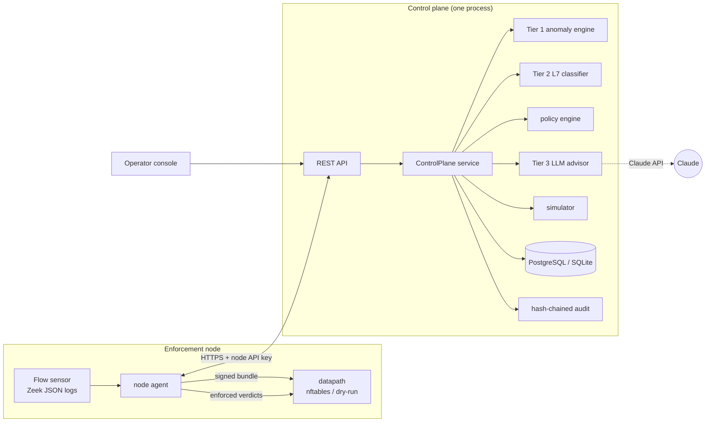
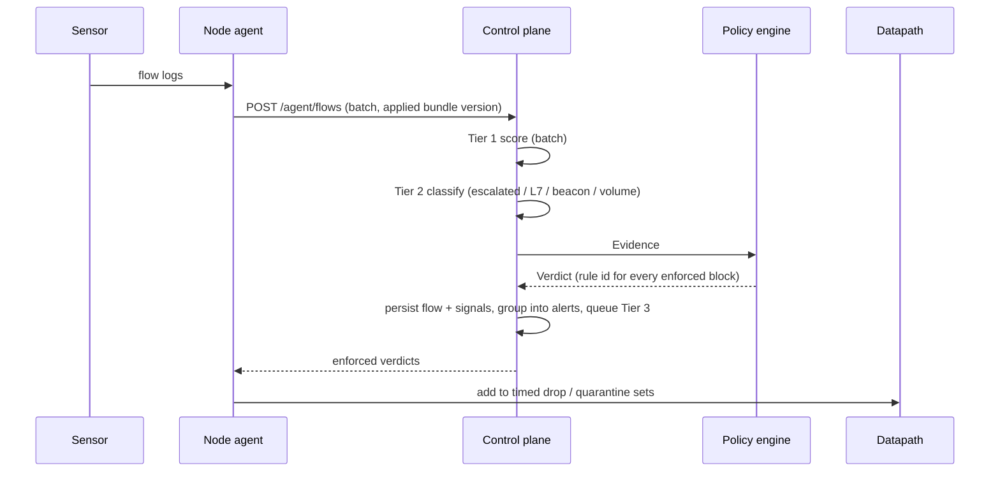
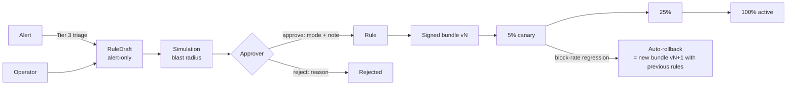

# Architecture

This document describes NeuraWall **as built**, and how it maps to the design blueprint in
[ai-firewall-project-layout.md](ai-firewall-project-layout.md). Where the implementation
deliberately differs from the blueprint, the difference and its reason are stated here and
recorded as an ADR.

## Components

| Blueprint module | Implementation | Notes |
|---|---|---|
| `core/*` | `neurawall/core` | Frozen, bounded pydantic models; redacting JSON logger; typed errors; layered config; Prometheus metrics. |
| `security/*` | `neurawall/security` | Ed25519 signing (`integrity`), hash-chained audit, RBAC + four-eyes, argon2 passwords, JWT sessions, API keys, rate limits and budgets. |
| `datapath` | `neurawall/modules/datapath` | nftables backend and dry-run backend behind one protocol. eBPF/XDP is a future backend (ADR-0002). |
| `flow-collector` | `neurawall/modules/flow_collector` | Validating JSON ingest, Zeek log join, synthetic traffic generator (demo, tests, golden corpus). |
| `anomaly-engine` | `neurawall/modules/anomaly_engine` | Tier 1. |
| `l7-classifier` | `neurawall/modules/l7_classifier` | Tier 2. |
| `llm-advisor` | `neurawall/modules/llm_advisor` | Tier 3, with guardrails and an offline advisor. |
| `policy-engine` | `neurawall/modules/policy_engine` | Arbitration, rule matching, hygiene, simulator, bundle signing/opening, staged rollout. |
| `control-plane` + `console-api` | `neurawall/services/control_plane` | One FastAPI service; the React console is served from it. |
| `node-agent` | `neurawall/services/node_agent` | Python instead of Rust (ADR-0008). |

### Layering

`core ← security ← modules ← services ← cli`, enforced by `import-linter` in CI:

- Core imports nothing from NeuraWall.
- Domain modules are independent of each other. Only `services` compose them. The
  blueprint lists control-plane and node-agent as modules; here they are a separate
  `services` layer, so the "modules depend only on core" rule stays enforceable (ADR-0008).
- `llm_advisor` may not import `policy_engine`, `datapath` or `services`. The zero-authority
  rule for Tier 3 is structural, not just a convention.

## Where inference runs

The blueprint places Tier 1 and Tier 2 on each node. NeuraWall runs them **centrally in the
control plane**, on the flows nodes ship (ADR-0008). This is the right trade-off for a
Python implementation: a single warm baseline, one place to update detectors, and nodes that
stay small. Nodes still enforce locally from their signed bundle:

1. **Static rules** (pure L3/L4 match, no direction) compile into the node's nftables table
   and apply at kernel speed, with no round-trip.
2. **Dynamic rules** (labels, SNI/DNS/HTTP/JA3, anomaly score, direction) are evaluated
   centrally. Enforced verdicts come back in the ingest response, and the agent adds them to
   timed nftables sets (`dyn_drop4/6`, `quarantine4/6`, TTL 10 min).

As in the blueprint, **the first packets of a flow are never blocked by inference**: a
verdict applies from the moment it reaches the datapath.

## Packet-to-verdict path

The policy engine used for a node's flows is the one for the **bundle version that node has
applied**. During a canary rollout, the central verdicts match what each node enforces.

## Tier authority

| Tier | Can do | Cannot do |
|---|---|---|
| 1 — anomaly | Raise a flow's score; with no matching rule, a score ≥ `anomaly_alert_threshold` raises an **alert** | Block |
| 2 — classifier | Label with confidence + attributions; a label ≥ 0.7 without a matching rule raises an **alert**; label-scoped **rules** can block | Block without a rule |
| 3 — advisor | Summaries, narratives, explanations, `RuleDraft`s (always alert-only, schema-validated, simulated) | Create or change a `Rule`, publish a bundle |
| Human | Approve drafts (optionally four-eyes), change rules, roll back bundles | Bypass the audit trail |
| Policy engine | Turn signals into actions via rules | — |

## Rule lifecycle

- **Blast radius** is the fraction of *legitimate* recent flows the rule would match. Flows
  already flagged by Tier 1 (≥ 0.8) or Tier 2 (≥ 0.7) are excluded. Enforcing a rule above
  `policy.blast_radius_threshold` (default 1%) requires explicit acknowledgement.
- Triage skips drafting when an existing rule already blocks all of an alert's traffic, and
  reuses an identical pending draft instead of creating a duplicate.
- **Rollback** republishes the previous good rule set as a new, higher version. Nodes enforce
  strictly increasing versions, so a replayed old bundle is always rejected.

## State and scaling

The control plane keeps Tier 1 baselines, rate limiters and the Tier 3 queue in memory. It
runs as **one process** and scales vertically. The Helm chart pins `replicas: 1` with a
`Recreate` strategy. Baselines rebuild from live traffic after a restart; warm-up is
configurable with `inference.baseline_warmup_flows`. Everything durable (rules, bundles,
flows, alerts, drafts, audit) lives in the database.

Rough sizing on one modern core: Tier 1 + Tier 2 + arbitration run at about 0.1 ms per flow in
batches. Persistence dominates, at a few thousand flows per second on PostgreSQL.

## Failure domains

| Component fails | Effect | Recovery |
|---|---|---|
| Control plane | Nodes keep enforcing their last-known-good bundle and cached dynamic verdicts until the TTL expires; no new rules | Agent reconnects with exponential backoff |
| Claude API / budget exhausted | Tier 3 degrades to the offline advisor; console shows *degraded* | Automatic on next successful call |
| Tier 2 overloaded | Excess invocations are shed (counted in `neurawall_tier2_rate_limited_total`); L3/L4 and Tier 1 unaffected | Automatic |
| nftables apply fails | New bundle is not applied; previous ruleset stays in force; error reported in heartbeat | Fix and re-sync |
| Forged or replayed bundle | Rejected on the node; counted in `bundle_rejections` | — |
| Datapath process gone | Traffic passes (fail-open, blueprint ADR-0006) | Supervisor restart |
